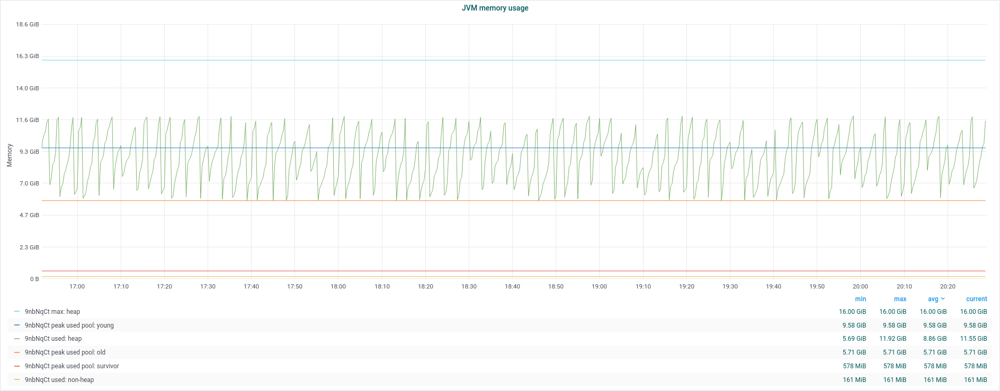
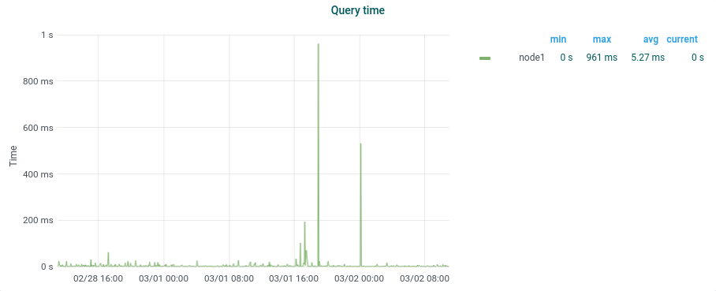
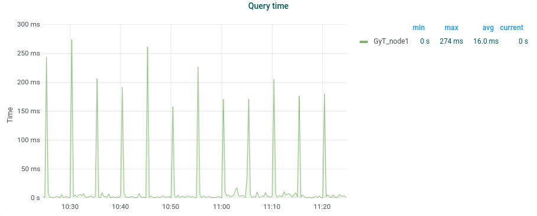

# Monitorización de Elasticsearch

```
GET _stats?filter_path=indices.index_name_here.
```

https://www.elastic.co/guide/en/elasticsearch/reference/current/cluster-nodes-stats.html

## Salud del cluster

### Nodos y shards

```
GET _cluster/health?pretty
# - green
# - yellow: falta al menos un shard réplica o está sin asignar
# - red: falta al menos un shard primario
```

Al crear un índice o al reiniciar un nodo, los shards afectados pasan por los estados `initializing` (`realocating`) y `started` o `unassigned`.

## Rendimiento del nodo

### CPU

Una actividad intensa del Garbage Collector puede producir picos de uso de CPU.

Se hacen dos tipos de recolección de basura: recientes y antiguas. Puede consultarse **count** y **time**
```
GET _nodes/stats/jvm?pretty
# jvm.gc.collectors.young.collection_count
# jvm.gc.collectors.young.collection_time_in_millis

# jvm.gc.collectors.old.collection_count
# jvm.gc.collectors.old.collection_time_in_millis
```

### RAM

Por regla general, se aconseja asignar <50% de la RAM disponible al heap de la JVM, y nunca más de 32GB*.

---
*El máximo de 32GB viene porque, para usar más, la JVM necesitaría punteros de 64 bits (no pudiendo usar entonces los OOPs comprimidos de 32 bits).

## Java

### Uso del heap y Garbage Collection

- Evitar que la JVM swapee a disco
- Definir la memoria heap para Elastic:

```
# si los valores de memoria máx. y mín. son iguales,
# elastic no necesita asignar memoria adicional en ejecución:
/bin/elasticsearch -Xmx16g -Xms16g
#               máximo^       ^mínimo

```

- Patrón de diente de sierra: indica que el GC de la JVM está funcionando correctamente.



Con varios nodos, la sierra se desdibuja porque cada GC tiene lugar en momentos distintos, pero puede reconocerse el patrón.
- ¿Cuánto heap? Por lo general, 50% de la RAM disponible.
```
GET /_cat/nodes?h=heap.max
```

## Rendimiento de las búsquedas

### Latencia por petición, ratio de peticiones

Las latencias por petición que expone Elasticsearch son por shard, no la de la petición en general.

```
# latencia por petición:
indices.search.query.total
indices.search.query.current
indices.search.query.time_in_millis

# ratio de peticiones:
indices.search.fetch.total
indices.search.fetch.current
indices.search.fetch.time_in_millis
```




## Rendimiento del indexado

### Latencia de indexado, ratio de indexado

```
indices.indexing.{total,current,time_in_millis}
indices.refresh.{total,time_in_millis}
indices.flush.{total,time_in_millis}
indices.get_missing.{total,time_in_millis}
```


