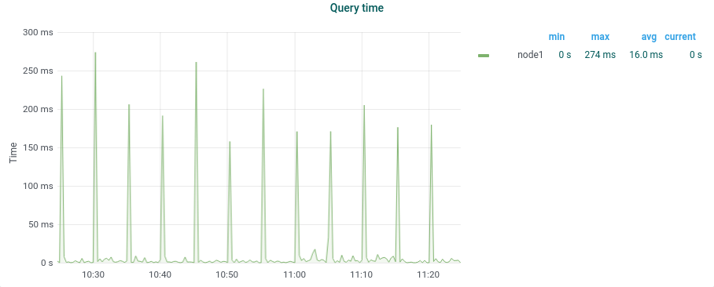
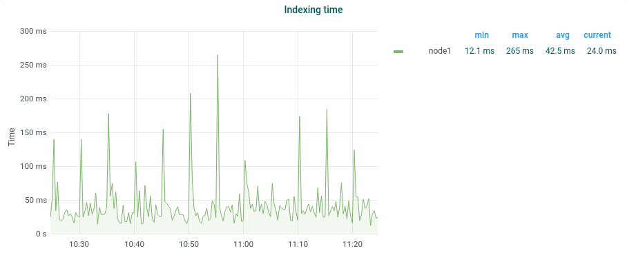

# Monitorización de Elasticsearch

Aquí se indican los endpoints de los que se obtienen estas métricas en la API de gestión de Elasticsearch, como referencia. Lo recomendable es vigilarlas usando el dashboard "Elasticsearch Details" que viene con [Theseus](https://repo1.naudit.es/theseus/theseus-master) y su ["elasticsearch-prometheus-exporter"](https://github.com/justwatchcom/elasticsearch_exporter) (las gráficas de esta sección están sacadas de los dashboards de Theseus). Si se tiene configurado el [repositorio deb de Naudit](https://repo1.naudit.es/deb-repo/naudit-repos), pueden instalarse Theseus y sus dependencias simplemente con `sudo apt install theseus-master`.


```
GET _nodes/stats?pretty
```
[[doc] Cluster nodes stats](https://www.elastic.co/guide/en/elasticsearch/reference/current/cluster-nodes-stats.html)
```
# Se puede filtrar en el JSON de respuesta, por ejemplo:

naudit@sonda:~$ curl localhost:27015/_stats?filter_path=_all.total.docs; echo
{"_all":{"total":{"docs":{"count":88863005,"deleted":117222}}}}

naudit@sonda:~$ curl localhost:27015/_nodes/stats?filter_path=nodes.*.{name,ip,jvm.gc.collectors}; echo
{"nodes":{"ADGpmzGlS1OdyYShUXCU5Q":{"name":"GyT_node1"}}}
{"nodes":{"ADGpmzGlS1OdyYShUXCU5Q":{"ip":"10.252.3.142:9300"}}}
{"nodes":{"ADGpmzGlS1OdyYShUXCU5Q":{"jvm":{"gc":{"collectors":{"young":{"collection_count":19857,"collection_time_in_millis":732896},"old":{"collection_count":0,"collection_time_in_millis":0}}}}}}}
```

## Salud del cluster

### Nodos y shards

```
GET _cluster/health?pretty
# - green
# - yellow: falta al menos un shard réplica o está sin asignar
# - red: falta al menos un shard primario
```

Al crear un índice o al reiniciar un nodo, los shards afectados pasan por los estados `initializing` (`realocating`) y `started` o `unassigned`.

## Java

### Uso del heap y Garbage Collection

- Patrón de diente de sierra: indica que el GC de la JVM está funcionando correctamente.


Con varios nodos, la sierra se desdibuja porque cada GC tiene lugar en momentos distintos, pero puede reconocerse el patrón.

- Evitar que la JVM swapee a disco (al arrancar la JVM de Elasticsearch reserva toda la RAM que podría necesitar y con eso nunca debería swapear. Por eso es importante asegurarse de que reserva todo de golpe, especialmente en Red Hat). [[1]](https://www.notion.so/Swap-d34ce6357d094e49ab3841bd8eca57e6)

## Rendimiento del nodo

### CPU

Un indexado cargado, queries pesadas o una actividad intensa del Garbage Collector pueden producir picos de uso de CPU. [[2]](https://www.datadoghq.com/blog/monitor-elasticsearch-performance-metrics/#memory-usage-and-garbage-collection)

Se hacen dos tipos de recolección de basura: recientes y antiguas. Puede consultarse **count** y **time**
```
GET _nodes/stats/jvm?pretty

# jvm.gc.collectors.young.collection_count
# jvm.gc.collectors.young.collection_time_in_millis

# jvm.gc.collectors.old.collection_count
# jvm.gc.collectors.old.collection_time_in_millis
```

### RAM

Por regla general, se aconseja asignar como máximo 50% de la RAM disponible al heap de la JVM [[3]](https://www.elastic.co/guide/en/elasticsearch/guide/current/heap-sizing.html), y nunca más de 32GB*.

---
*El máximo de 32GB viene porque, para usar más, la JVM necesitaría punteros de 64 bits (no pudiendo usar entonces los OOPs comprimidos de 32 bits).

## Rendimiento de las búsquedas

### Latencia por petición, ratio de peticiones

Las latencias por petición que expone Elasticsearch son por shard, no la de la petición en general.

```
GET _nodes/stats?filter_path=nodes.*.indices.search*

# latencia por petición:
indices.search.query_total
indices.search.query_current
indices.search.query_time_in_millis

# ratio de peticiones:
indices.search.fetch_total
indices.search.fetch_current
indices.search.fetch_time_in_millis
```




## Rendimiento del indexado

### Latencia de indexado, ratio de indexado

```
GET _nodes/stats?filter_path=nodes.*.indices.indexing*

# latencia de indexado:
indices.indexing.index_{total,current,time_in_millis}

indices.refresh.total{,time_in_millis}
indices.flush.total{,time_in_millis}
indices.get_missing.total{,time_in_millis}
```



