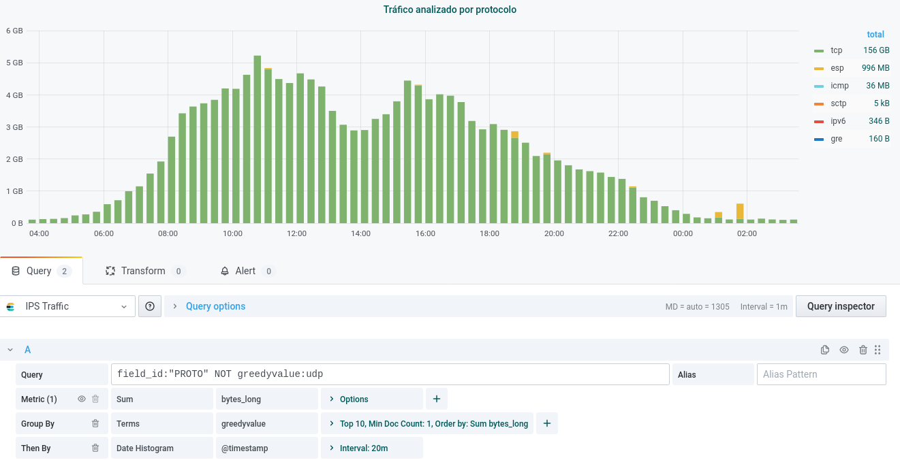
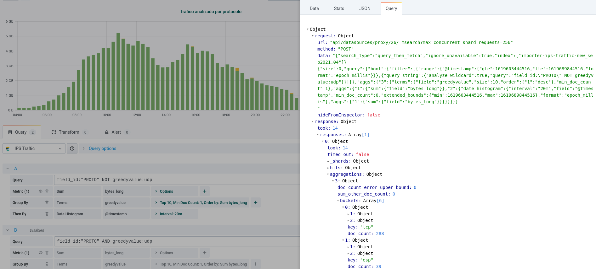

# Queries

Para definir búsquedas, Elasticsearch cuenta con un completo [DSL](https://www.elastic.co/guide/en/elasticsearch/reference/7.11/query-dsl.html) (Domain Specific Language) basado en JSON.
La API contra la que se hacen las queries es `indice-con-mis-datos/_search`, mediante peticiones GET.
Las búsquedas más simples se compondrían de una sola query y Elastic nos devolvería los resultados en los *hits* de la respuesta.
Por ejemplo, para buscar en el índice "alarms" qué documentos tienen system=WAF:

```
naudit@sonda:~$ curl localhost:27015/alarms/_search?pretty -H 'Content-Type: application/json' -d '
{
    "query": {
      "match": {
        "system": "WAF"
      }
  }
}'

# RESPUESTA:

{
    "took": 5,
    "timed_out": false,
    "_shards": {
        "total": 1,
        "successful": 1,
        "skipped": 0,
        "failed": 0
    },
    "hits": {
        "total": {
            "value": 5597,       # <- NÚMERO DE DOCUMENTOS QUE COINCIDEN CON LA QUERY
            "relation": "eq"     # <- (si hay más de 10k, aquí dirá que es "gte")
        },
        "max_score": 4.3358507,
        "hits": [                # <- ARRAY DE LOS PRIMEROS DOCUMENTOS (por defecto devuelve 10)
            {
                "_index": "alarms",
                "_type": "_doc",
                "_id": "LnEK_3cB6pXqTmlOjb5p",
                "_score": 4.3358507,
                "_source": {
                    "@timestamp": 1614891617617,
                    "severity": "3",
                    "value": 1459.0,
                    "identif": "WAF-3-Errores_400-servidorB.com",
                    "system": "WAF",
                    "title": "Errores 400",
                    "term": "403"
                }
            },
            {
                "_index": "alarms",
                "_type": "_doc",
                "_id": "ynIT_3cB6pXqTmlOxtwq",
                "_score": 4.3358507,
                "_source": {
                    "@timestamp": 1614892221935,
                    "severity": "4",
                    "value": 10723.0,
                    "identif": "WAF-4-servidorZ.com",
                    "system": "WAF",
                    "title": "Peticiones por cliente",
                    "term": "13.0.171.0"
                }
            },
 ...
        ]
    }
}
```

La query de este ejemplo es de tipo "[match](https://www.elastic.co/guide/en/elasticsearch/reference/current/query-dsl-match-query.html)", que es la más común.
También existen queries "[term](https://www.elastic.co/guide/en/elasticsearch/reference/current/query-dsl-term-query.html)" (para búsquedas exactas) o
"[range](https://www.elastic.co/guide/en/elasticsearch/reference/current/query-dsl-range-query.html)" (para rangos numéricos),
pero para la mayoría de casos con queries match suele bastar.
De hecho, aunque estos tipos de queries se pueden combinar mediante queries [compuestas](https://www.elastic.co/guide/en/elasticsearch/reference/current/compound-queries.html), si queremos hacer una búsqueda con condiciones booleanas generalmente es más fácil usar el parser de queries "query string".

## Query string

Una query se puede expresar con operadores booleanos en forma de texto, que de hecho es la forma en la que se filtra en los dashboards de Grafana y Kibana.
Por ejemplo, la siguiente query devuelve tanto los documentos que tienen term=Server1 como los que tienen term=Server2, pero excluye los documentos con system=Prueba:

```
naudit@sonda:~$ curl localhost:27015/alarms/_search -H 'Content-Type: application/json' -d '
{
    "query":
    {
        "query_string": {"query": "term:Server1 OR term:Server2 NOT system:Prueba"}
    }
}'
{"took":39,"timed_out":false,"_shards":{"total":1,"successful":1,"skipped":0,"failed":0},"hits":{"total":{"value":100,"relation":"eq"},"max_score":5.7918024,"hits":[{"_index":"alarms","_type":"_doc","_id":"O5oC6HcB6pXqTmlOiJfS","_score":5.7918024,"_source":{"@timestamp":1614505215961,"severity":"4","value":12516.0,"identif":"APP-4-Número_elevado_de_eventos_windows-Server2","system":"APP","title":"Número elevado de eventos windows","term":"Server2"}},{"_index":"alarms","_type":"_doc","_id":"RZoC6HcB6pXqTmlOiZc9","_score":5.7918024,"_source":{"@timestamp":1614505216291,"severity":"3","value":9161.0,"identif":"APP-3-Anomalía_en_eventos_Windows_de_error_de_aplicación-Server1","system":"APP","title":"Anomalía en eventos Windows de error de aplicación","term":"Server1"}},...]}}
```

# Agregaciones

Las [agregaciones](https://www.elastic.co/guide/en/elasticsearch/reference/current/search-aggregations.html) devuelven unos valores resumen de los datos de una query, ya sea en forma de [medidas estadísticas](https://www.elastic.co/guide/en/elasticsearch/reference/current/search-aggregations-metrics.html), intervalos de un [histograma](https://www.elastic.co/guide/en/elasticsearch/reference/current/search-aggregations-bucket-histogram-aggregation.html), [términos](https://www.elastic.co/guide/en/elasticsearch/reference/current/search-aggregations-bucket-terms-aggregation.html) distintos en un campo, etc.

Hay muchos tipos de agregaciones, pero las más típicas y prácticas son las que hacen Grafana y Kibana cuando extraen los datos con los que pintan sus gráficas:



En este ejemplo, vemos un panel de Grafana que tiene una serie temporal. La query A define qué datos estamos pidiéndole a Elasticsearch para hacer esta gráfica:
- En el filtro, nos quedamos con los documentos que tienen field_id=PROTO y cuyo campo "greedyvalue" no sea udp.
- Como es una serie temporal, la agregación de la última fila tiene que ser "Date Histogram" sobre el campo que contenga la fecha en este índice. Al ser este campo "@timestamp" una variable continua, necesitamos discretizarla para representarla. Por eso, definimos un intervalo igual a 20 minutos.
- La métrica que vamos a representar en el eje Y es la operación "sum" sobre el campo "bytes_long". Es decir, le pedimos a Elasticsearch que, para cada intervalo que hemos definido en el Date Histogram, mire el campo numérico "bytes_long" en los documentos que entran en ese intervalo y nos devuelva su suma.
- En esta gráfica queremos obtener el total de bytes según el protocolo (que está en el campo "greedyvalue"), así que hacemos una última agregación: "Group By Terms: greedyvalue". Aparecen algunas opciones más en esta fila: "Top" (cuántos valores distintos queremos extraer del campo "greedyvalue"), "Min Doc Count" (recomendable poner esta opción al menos a 1, para que solo opere con los términos que aparecen en algún documento) y "Order by" (lo que más sentido tiene es ordenarlos por la métrica que estemos representando, es decir, por "sum(bytes_long)").

Haciendo click en el botón "Query inspector", se revela qué petición le ha mandado realmente Grafana a Elasticsearch (útil si queremos debuggear o simplemente conocer cómo se construye en realidad nuestra query):



Para obtener datos de Elasticsearch sin depender de interfaces gráficas, lo mejor es utilizar las librerías que se explican en la
[sección de Python](../librerias_de_elasticsearch_en_python/elasticsearch.html) de este manual. Como hemos visto, las queries pueden ser complicadas de escribir (en especial cuando añadimos agregaciones) y también puede ser un poco incómodo tratar con los resultados que devuelven, así que conviene familiarizarse con estas librerías y con los objetos más comunes del DSL de Elasticsearch.
