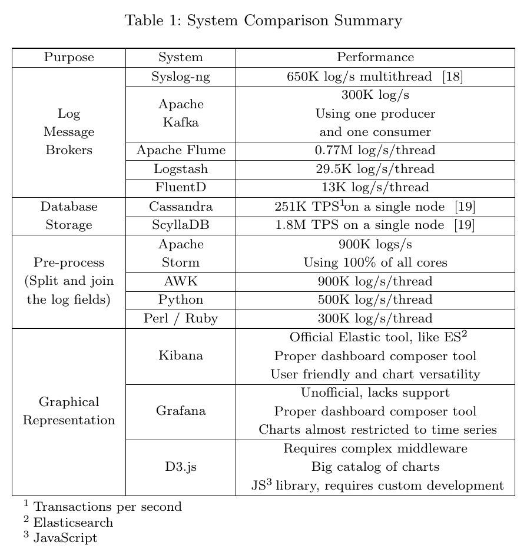

# Investigación para "Loginson"

En 2016, Carlos Vega (ex-empleado de Naudit) publicó un artículo sobre ["Loginson", un sistema de transformación y carga para análisis de logs a gran escala en grandes infraestructuras IT](https://arxiv.org/abs/1703.02602). En él, hizo un estudio sobre qué herramientas se adecuarían mejor al caso de uso que se proponía (la recoleccción y procesamiento de logs para la infraestructura de Correos).

Este escenario implicaba dos necesidades básicas:
- Una alta tasa de ingesta (estimada en 3 millones de líneas de log por segundo).
- La capacidad de inspeccionar los logs en dos fases secuenciales:
    * Resumen de alto nivel sobre los datos (ej.: códigos HTTP devueltos por una serie de servidores a lo largo de periodos amplios de tiempo).
    * Análisis detallado de ciertos logs sobre un intervalo seleccionado (ej.: inspeccionar la cusa de un incremento de errores 500).

Los requerimientos del proyecto eran los siguientes:
- Centralización de los logs que generan los sistemas en producción del cliente (Correos).
- Preprocesado de los datos en crudo para ofrecer una perspectiva resumida a alto nivel de los datos (que siguen varios formatos distintos)
- Representación gráfica de los datos resumidos

Se tuvieron en cuenta ciertos aspectos a la hora de elegir la base de datos idónea para este caso de uso:

- Hay varias razones por las que **no interesaba usar una base de datos distribuida**:
    * En algunos servidores críticos o equipos de red no se pueden instalar agentes. Esto impide que puedan preprocesar y distribuir sus logs hacia varios nodos recolectores.
    *  Es mucho más simple hacer que todos los equipos envíen a un único punto central.
    *  Con una base de datos centralizada es más fácil implementar alta disponibilidad (replicando el punto central en varios hosts) y redundancia, ya que un sistema de recolección centralizado no tiene que mantener estados.

- Normalmente, las **queries** que se piden en la gestión de redes y sistemas son bastante **sencillas**. Suelen consistir en rangos de direcciones IP y de puertos dentro de un intervalo temporal. Por tanto, no se necesita soportar expresiones complejas ni la flexibilidad de SQL.

- Se prioriza **escalabilidad vertical** sobre escalabilidad horizontal. Además de las cuestiones mencionadas anteriormente (como son la alta tasa de ingesta y las ventajas expuestas sobre la centralización de la recolección frente a los sistemas distribuidos), se añade el argumento de que un número de nodos reducido permite una configuración activo-activo sencilla para replicación de datos, algo que se complicaría más con un alto número de nodos. También debe considerarse el *overhead* que conlleva la escalabilidad horizontal, típica de los sistemas de big data, especialmente si se utilizan pocos nodos.

En el artículo se incluía una revisión del estado del arte para el caso de uso específico de almacenamiento y visualización de logs. Se concluyó que en aquel momento ningún sistema cumplía totalmente los requerimientos mencionados.

La comparativa se dividió en cuatro secciones, según el tipo de herramientas evaluadas: brokers y balanceadores de carga, almacenamiento en bases de datos, preprocesado y representación gráfica. Esta tabla resume los aspectos de rendimiento más destacados de cada herramienta en su campo:

Los detalles de cómo se llevó a cabo cada evaluación se recogen en las páginas 6-10 del artículo.

Como conclusión, en Correos se optó por la combinación de Elasticsearch y Kibana, empleando un componente que en el artículo se denomina *LoginsonRecepor*, y que centraliza los logs y los inserta en Elasticsearch. Ese componente después se liberó con el nombre de [ElasticsearchImporter](https://github.com/carlosvega/ElasticsearchImporter).
